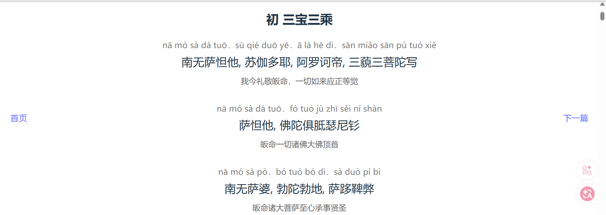

# 楞严咒

一个基于 Vue 3 开发的楞严咒在线诵读和学习网页应用，提供拼音注音和含义对照。

## 功能特性
- 完整的楞严咒分章呈现
- 拼音注音和含义对照
- 便捷的章节导航

## 界面预览



## 项目结构
```
src/
├── views/          # 页面组件
│   ├── Home.vue    # 首页（章节列表）
│   ├── Chant.vue   
│   └── prepare.vue 
├── data/           # 数据文件
│   ├── chants.js   # 章节配置
│   └── chapter*.json # 各章内容
└── router/         # 路由配置
```

## 数据来源

本项目的楞严咒文本数据来自 [eiffelqiu/ShurangamaMantra](https://github.com/eiffelqiu/ShurangamaMantra) 项目。作者提供了精心编整的楞严咒 Markdown 文件（包含注音和注解）。本项目通过 Python 脚本将这些 MD 文件转换为 JSON 格式，并集成到 Vue 应用中。

## 技术栈
- Vue 3
- Vue Router
- Vite
- JavaScript ES6+
- Python

## 快速开始

### 安装依赖
```bash
npm install
```
### 开发服务器
```bash
npm run dev
```
### 构建生产版本
```bash
npm run build
```